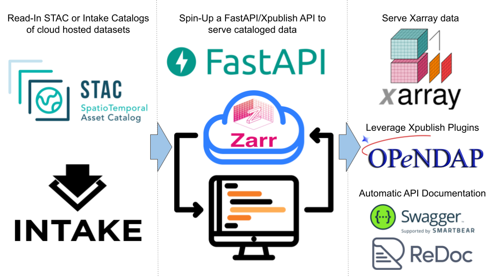

[](https://github.com/LimnoTech/Catalog-To-Xpublish/actions/workflows/pre-commit.yml)
[](https://github.com/LimnoTech/Catalog-To-Xpublish/actions/workflows/tests.yml)

# Catalog-To-Xpublish

This repository enables one to spin-up a `fastapi`/`xpublish` server from either an Intake or STAC catalog.



## Features
* Serves cataloged [`.zarr`](https://zarr.readthedocs.io/en/stable/) or [`.nc`](https://www.unidata.ucar.edu/software/netcdf/) data over a REST API without pre-loading.
* Parses catalog hierarchy and creates matching URL paths/prefixes (i.e., "`https://server.com/catalog1/sub_catalog2/sub_catalog_5/datasets/{dataset_id}`").
* Fully compatible with any 3rd xpublish [dataset router](https://xpublish.readthedocs.io/en/latest/plugins.html#dataset-router-plugins), or [app router plugins](https://xpublish.readthedocs.io/en/latest/plugins.html#app-router-plugins). For example, [`xpublish-opendap`](https://github.com/xpublish-community/xpublish-opendap) can be included to provide key OPeNDAP capabilities (i.e., slicing).
* Leverages a [factory pattern](https://en.wikipedia.org/wiki/Factory_method_pattern) architecture and Python [Abstract Base Classes (ABCs)](https://docs.python.org/3/library/abc.html) to streamline the addition of more catalog schema as needs develop.
* Thanks to `FastAPI`, interactive [Swagger](https://github.com/swagger-api/swagger-ui) and [Redoc](https://github.com/Redocly/redoc) API documentation endpoints are automatically generated on spin-up.

## Getting Started

1. Make a conda environment by cloning `environment.yml`.
2. Use the following conda-build command to install this `catalog_to_xpublish` into your new environment.
    ```
    conda develop {YOUR_PATH}/Xpublish-OPeNDAP-Server/src
    ```
3. Select a Intake `.yaml` or STAC `.json` file path or URL to serve data from.
4. Use the `catalog_to_xpublish.create_app()` function to spin-up a `FastAPI()` application. See example below:
    ```python
    import catalog_to_xpublish
    from fastapi import FastAPI
    from xpublish_opendap import OpenDapPlugin

    # identify a catalog
    CATALOG_URL = 'https://code.usgs.gov/wma/nhgf/stac/-/raw/main/catalog2/catalog.json'

    # create FastAPI app instance
    app = catalog_to_xpublish.create_app(
        catalog_path=CATALOG_URL,
        catalog_type='stac',
        app_name='Test NHGF Catalog Server',
        xpublish_plugins=[OpenDapPlugin],
    )
    ```
5. Use `uvicorn` to deploy the server. For example, assuming the previous code snippet was called in `run_server.py`:
    ```python
    # define server hosting location
    LOCAL_HOST = '127.0.0.1'
    LOCAL_PORT = 8000

    # define wrap uvicorn.run() in main()
    def main() -> None:
    """Main function to run the server."""
        uvicorn.run(
            'run_server:app',
            host=LOCAL_HOST,
            port=LOCAL_PORT,
            reload=True,
        )

    # start the server when run_server.py is executed
    if __name__ == '__main__':
        main()
    ```

## Endpoints
* All [core `xpublish` endpoints/routes](https://xpublish.readthedocs.io/en/latest/tutorial.html#default-api-routes) are supported after a `datasets/{dataset_id}` is selected.
* At each level in the catalog hierarchy one can:
    * See the parent catalog via `/parent_catalog`.
    * See all sub-catalogs via `/catalogs`.
    * See all servable datasets via `/datasets`.
    * Get the catalog represented as YAML text via `/yaml`.
    * Get the catalog represented as JSON via `/json`.
    * FastAPI documentation via `/docs` (for Swagger) or `/redoc` for Redoc. Note that `xpublish` endpoints will only appear at a catalog level containing servable datasets.
* After a `datasets/{dataset_id}` is selected, one can also use any additional endpoints added via `xpublish` plugins. These endpoints will appear in the API documentation endpoint `/docs`.

## Logging
By default, `catalog_to_xpublish` will log to the console at the "INFO" level.

One can change logging behaviors by passing in a `config_logging_dict` argument to `catalog_to_xpublish.create_app()` which contains any of following keys:
* `log_level`: The logging level. Default is "INFO".
* `log_file_path`: The path to a log file. Default is `None`.
* `date_format`: The date format for log messages. Default is `'%Y-%m-%dT%H:%M:%S'`.
* `log_format`: The log message format. Default is `'[%(asctime)s] %(levelname)s - %(message)s'`.
* `stream_handlers`: Stream handler(s) to use (can be a list). Default is is console.

For example, here is how one can log at the DEBUG level to an existing `logging.StreamHandler` and log file:
```python
import catalog_to_xpublish
import logging

# identify a catalog
CATALOG_URL = 'https://code.usgs.gov/wma/nhgf/stac/-/raw/main/catalog2/catalog.json'

# set logging config
existing_stream_handler: logging.StreamHandler = ...
LOGGING_CONFIG = {
    'log_level': 'DEBUG',
    'log_file_path': 'my_log_file.log',
    'stream_handlers': [existing_stream_handler],
}

# create FastAPI app instance
app = catalog_to_xpublish.create_app(
    catalog_path=CATALOG_URL,
    catalog_type='stac',
    config_logging_dict=LOGGING_CONFIG,
)
```

## Contributing
### General
We strongly encourage open-source contributions to this repository! I am new to this tech stack, and likely have much to learn from the wider `xpublish` community.

Please note any bugs or feature requests via our GitHub Issues page.

Before creating a pull request please use `pytest` to run our `/tests` suite to make sure that no behavior was inadvertently altered. If you create a new feature (i.e., an additional catalog implementation), we encourage you to create a test `tests/test_{#}_{new_feature_name}.py` file for it.

Additionally, before making a pull request please run our pre-commit hooks locally:
```
(base) cd {PATH}/{TO}/{REPO}

(base) conda activate catalog_to_xpublish_dev
(catalog_to_xpublish_dev) pre-commit run --all-files
```

### Creating a new catalog implementation
As environmental science progresses, we expect additional catalog schemas beyond Intake and STAC to become relevant. Alternatively, STAC supports extensions, and one may need to build an adjusted STAC implementation for specific needs/desires.

A catalog implementation consists of three core components/classes. To create a new catalog implementation one must define a concrete implementation of each of the following abstract base classes.
* `base.CatalogSearcher` - Responsible for parsing catalog hierarchy.
* `base.CatalogToXarray` - Responsible for reading catalog items into `xarray.Dataset` objects and writing attributes.
* `base.CatalogRouter` - Responsible for defining our core [endpoints](#endpoints) behavior and attaching it to a `fastapi.APIRouter`.

The concrete versions of the above classes then need to be decorated as "products" so that `catalog_to_xpublish.CatalogImplementationFactory` can identify, validate, and register the new catalog implementation.


This process is demonstrated below:
1. Create a concrete implementation of `base/searcher_base.CatalogSearcher` and decorate it as a `factory.CatalogSearcherClass`. See `CatalogSearcher` docstring information for more detail. Note that one must create a function for all abstract methods, even if it returns a `NotImplementedError`.
    ```python
    from catalog_to_xpublish.base import (
        CatalogSearcher,
        CatalogEndpoint,
    )
    from catalog_to_xpublish.factory import CatalogSearcherClass

    @CatalogSearcherClass
    class NewCatalogTypeSearcher(CatalogSearcher):

        catalog_type: str = 'new_catalog_type'

        @property
        def catalog_path(self) -> Path | str:
            ...

        @property
        def suffixes(self) -> List[str]:
            ...

        @property
        def catalog_object(self) -> object:
            ...

        def parse_catalog(
            self,
            catalog: Optional[object] = None,
            parent_path: Optional[str] = None,
            list_of_catalog_endpoints: Optional[List[CatalogEndpoint]] = None,
        ) -> List[CatalogEndpoint]:
            """Recursively searches a catalog for a search term."""
            ...
    ```
2. Create a concrete implementation of `base/io_base.CatalogToXarray` and decorate it as a `factory.CatalogIOClass`. See `CatalogToXarray` docstring information for more detail.
    ```python
    import xarray as xr
    from catalog_to_xpublish.base import CatalogToXarray
    from catalog_to_xpublish.factory import CatalogIOClass

    @CatalogIOClass
    class NewCatalogToXarray(CatalogToXarray):

        catalog_type: str = 'new_catalog_type'

        def write_attributes(
            self,
            ds: xr.Dataset,
            info_dict: Dict[str, Any],
        ) -> xr.Dataset:
            """Write attributes from the catalog object to the dataset.attrs."""
            ...

        def get_dataset_from_catalog(
            self,
            dataset_id: str,
        ) -> xr.Dataset:
            """Get an xarray dataset from the catalog object."""
            ...
    ```
3. Finally, create a concrete implementation of `base/router_base.CatalogRouter` and decorate it as a `factory.CatalogRouterClass`. See `CatalogRouter` docstring information for more detail. note that one can extend this class with additional endpoints however necessary.
    ```python
    from fastapi.responses import (
        HTMLResponse,
        PlainTextResponse,
        JSONResponse,
    )
    from catalog_to_xpublish.server_functions import add_base_routes
    from catalog_to_xpublish.base import CatalogRouter
    from catalog_to_xpublish.factory import CatalogRouterClass

    @CatalogRouterClass
    class NewCatalogRouter(CatalogRouter):

        catalog_type: str = 'new_catalog_type'

        def __init__(
            self,
            catalog_endpoint_obj: CatalogEndpoint,
            prefix: Optional[str] = None,
        ) -> None:
            """An init that contains a call to server_functions.add_base_routes(self)"""
            # add routes for all base CatalogRouter endpoints/class functions
            super().__init__(
                catalog_endpoint_obj=catalog_endpoint_obj,
                prefix=prefix,
            )
            ...

        def list_sub_catalogs(self) -> List[str]:
            """Returns a list of sub-catalogs."""
            ...

        def get_parent_catalog(self) -> str:
            """Returns the parent catalog."""
            ...

        def get_catalog_as_yaml(self) -> PlainTextResponse:
            """Returns the catalog yaml as plain text."""
            ...

        def get_catalog_as_json(self) -> JSONResponse:
            """Returns the catalog as JSON."""
            ...
    ```
4. Make sure the catalog searcher, io class, and router class are included within their respective module `__init__.py` files.
5. At this upon spin-up the `factory.CatalogImplementationFactory` will recognize (via the decorators) each component of the catalog implementation and register it as valid.
6. Use `catalog_to_xpublish.CatalogImplementationFactory.get_all_implementations()` to return a dictionary of all registered catalog implementations.
